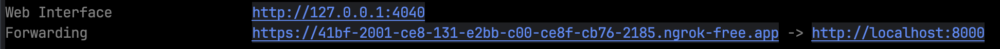

# グルメお嬢様
#### 最終更新日（2024 2/3）
## 概要
キーワードに基づき飲食店を検索してくれるお嬢様LINEBotです。
まず「お腹すいた」などのメッセージを入力すると、キーワードを求める返信が届きます。
その後、自分の探したい地名を入力することでキーワードに基づき、その周辺の飲食店をランダムに返信します。

## 使用方法
### pythonの環境構築

まずは以下のコマンドを入力してPythonがインストールされているか及びバージョンの確認をしてください。
```bash
python -V
```
Pythonのバージョンが表示されたならインストールされています。
表示されていなければpyenvを基に環境構築を行ってください。

### requirements.txtでのpipインストール
以下のpipコマンドを用いてrequirements.txtに書かれているインストールを行います。
```bash
pip install -r requirements.txt
```
アンインストールは以下のコマンドで実行できます。
```bash
pip uninstall <package-name>
```

### config.jsonの作成
jsonディレクトリ下でconfig.jsonを作成してください。
そして、以下のようにLINE DevelopersからLINEチャンネルシークレットとユーザーIDとチャンネルアクセストークンを入力してください。
```json
{
    "LINE_CHANNEL_SECRET": "<YOUR_CODE>",
    "LINE_CHANNEL_ACCESS_TOKEN": "<YOUR_CODE>",
    "API_KEY": "<YOUR_CODE>"
}

```

### 実行方法
ディレクトリ下で以下のコマンドを入力してください。
```bash
make app
```
このコマンドによりFlaskサービスが稼働します。

別ターミナルを開き以下のコマンドを入力してください。
```bash
ngrok http 8000
```
すると以下のようなサーバーが立ち上がるので

このForwardingのURLをコピーし、後部に```/callback```とつけてLINEDevelopersのWebhook URLにペーストしてください。

その後、検証ボタンを押してステータスコード200が返ってくることを確認してください。

## 使い方
「お腹すいた」などの腹減ったアピールコメントしてください。
すると「何が食べたいですの」と返信が返ってくるので、返信の流れに沿って答えてください。

## TODO
・位置情報から検索できるように
・サーバーレンタルし無料配布
・お嬢様のアイコン作成


## 参考文献
・[LINE Developers](https://developers.line.biz/ja/reference/messaging-api/#messages)<br>
・[Pythonで位置情報を活用したLINEボットを作ってみた](https://qiita.com/kotmats/items/8de977eefcbb6d97ec1d)<br>
・[ホットペッパーAPI](https://webservice.recruit.co.jp/doc/hotpepper/reference.html)<br>
・[LINE Botで位置情報を活用する](https://qiita.com/siganai_poteto/items/c3863ec05a8a6517f167)<br>
